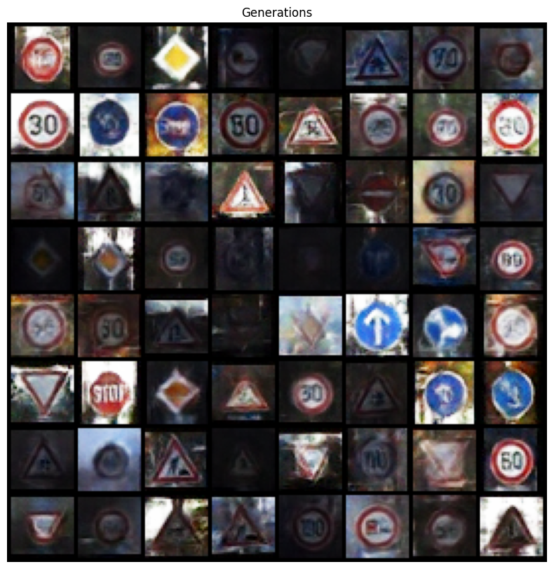

# Road signs generations
## Task
Given database of road signs generate 1000 - metric 
Fréchet inception distance - https://en.wikipedia.org/wiki/Fr%C3%A9chet_inception_distance. 

FID: 53

## Implementation
We implemented from scratch:
- generative adversarial network  `DCGAN.py`
- variational auto-encoder `VAE.py`  